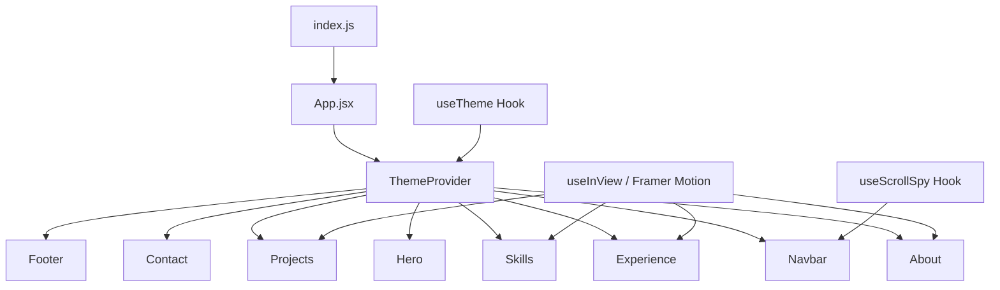

# Design Document: Portfolio Redesign

## Overview

This design transforms the existing bootcamp-era React + Chakra UI portfolio into a modern, premium single-page application using React 18, Tailwind CSS, and Framer Motion. The architecture follows a component-based approach with a centralized theme system, scroll-aware navigation, and performant animations. The existing Create React App toolchain is retained, with Tailwind CSS integrated via PostCSS. All Chakra UI, Emotion, styled-components, and redundant animation libraries are removed.

The design prioritizes:
- Dark-mode-first aesthetic with smooth theme transitions
- Impact-driven content highlighting professional metrics
- Minimal dependency footprint for fast load times
- Accessible, semantic markup throughout

## Architecture

The application is a single-page React app with the following high-level architecture:



### Key Architectural Decisions

1. **Tailwind CSS over Chakra UI**: Tailwind provides utility-first styling with zero runtime JS overhead. Chakra UI's runtime theme provider and component abstractions add unnecessary bundle weight for a static portfolio. Tailwind's dark mode via `class` strategy integrates cleanly with a custom ThemeProvider.

2. **Framer Motion as sole animation library**: Replaces AOS (scroll-triggered), react-typed (typing effect), and ad-hoc CSS transitions. Framer Motion provides a unified API for entrance animations, scroll-triggered animations (via `useInView`), and layout transitions.

3. **Custom scroll spy over react-scroll**: A lightweight `useScrollSpy` hook using `IntersectionObserver` replaces the react-scroll dependency. This provides active section detection with zero additional bundle cost.

4. **Flat component structure**: All components live in `src/components/` with no nesting. Data (experience entries, projects, skills) is co-located in `src/data/` as plain JS objects.

5. **Retain Create React App**: CRA is already configured and working. Migrating to Vite or Next.js is out of scope for this redesign. Tailwind CSS integrates with CRA via `craco` or direct PostCSS configuration.

## Components and Interfaces

### ThemeProvider

```jsx
// src/context/ThemeContext.js
const ThemeContext = React.createContext();

function ThemeProvider({ children }) {
  const [theme, setTheme] = useState(() => {
    return localStorage.getItem('theme') || 'dark';
  });

  useEffect(() => {
    const root = document.documentElement;
    root.classList.remove('light', 'dark');
    root.classList.add(theme);
    localStorage.setItem('theme', theme);
  }, [theme]);

  const toggleTheme = () => setTheme(prev => prev === 'dark' ? 'light' : 'dark');

  return (
    <ThemeContext.Provider value={{ theme, toggleTheme }}>
      {children}
    </ThemeContext.Provider>
  );
}
```

### useScrollSpy Hook

```jsx
// src/hooks/useScrollSpy.js
function useScrollSpy(sectionIds, offset = 100) {
  const [activeId, setActiveId] = useState('');

  useEffect(() => {
    const observer = new IntersectionObserver(
      (entries) => {
        entries.forEach(entry => {
          if (entry.isIntersecting) {
            setActiveId(entry.target.id);
          }
        });
      },
      { rootMargin: `-${offset}px 0px -50% 0px` }
    );

    sectionIds.forEach(id => {
      const el = document.getElementById(id);
      if (el) observer.observe(el);
    });

    return () => observer.disconnect();
  }, [sectionIds, offset]);

  return activeId;
}
```

### Navbar

- Fixed position, glassmorphism background (`backdrop-blur`)
- Desktop: horizontal link list + Resume button + theme toggle
- Mobile (<768px): hamburger icon toggling a slide-down menu
- Active section link highlighted via `useScrollSpy`
- Smooth scroll via native `element.scrollIntoView({ behavior: 'smooth' })`

### Hero

- Full viewport height (`h-screen`)
- Centered content: name (h1), animated title with Framer Motion text reveal, tagline
- Two CTA buttons: "View Projects" and "Get in Touch"
- Social icon row: GitHub, LinkedIn, Email
- Staggered entrance animation using Framer Motion `variants` and `staggerChildren`

### About

- Two-column layout: profile image (left), summary + stats (right)
- Profile image with subtle border/glow effect
- Impact stat cards in a row: "40% Faster Load Times", "90% Test Coverage", "3000+ Issues Resolved", "2000+ Test Cases"
- Stats animate with count-up effect on scroll into view
- Core competencies as pill/tag elements

### Experience

- Vertical timeline with alternating left/right entries on desktop, stacked on mobile
- Each entry: company logo area, role title, company name, date range, achievement bullets
- Current position visually distinguished with an accent indicator
- Sequential entrance animation per entry on scroll

### Skills

- Categorized grid: Frontend, Backend, Testing & QA, DevOps & Tools, AI Tools
- Each skill: icon + name label
- Staggered grid entrance animation on scroll

### Projects

- Responsive grid: 2 columns on desktop, 1 on mobile
- Each card: project name, description, tech stack tags, impact metrics, live demo link, GitHub link
- Hover effect: subtle scale + shadow elevation
- Staggered entrance animation on scroll

### Contact

- Two-column layout: form (left), contact info + social links (right)
- Form fields: name, email, message with inline validation
- Submit via Formspree (`https://formspree.io/f/{form_id}`)
- Success/error state feedback after submission
- Direct links: email mailto, LinkedIn, GitHub

### Footer

- Minimal footer with copyright, "Built with React & Tailwind CSS" tagline
- Social icon links repeated for convenience

### Section Wrapper (Reusable)

```jsx
// src/components/SectionWrapper.jsx
function SectionWrapper({ id, children, className = '' }) {
  return (
    <section id={id} className={`py-20 px-4 md:px-8 lg:px-16 ${className}`}>
      <div className="max-w-6xl mx-auto">
        {children}
      </div>
    </section>
  );
}
```

### AnimatedSection (Reusable scroll-triggered animation)

```jsx
// src/components/AnimatedSection.jsx
import { motion } from 'framer-motion';

const containerVariants = {
  hidden: { opacity: 0 },
  visible: {
    opacity: 1,
    transition: { staggerChildren: 0.1 }
  }
};

const itemVariants = {
  hidden: { opacity: 0, y: 20 },
  visible: { opacity: 1, y: 0, transition: { duration: 0.5 } }
};

function AnimatedSection({ children, className = '' }) {
  return (
    <motion.div
      variants={containerVariants}
      initial="hidden"
      whileInView="visible"
      viewport={{ once: true, margin: "-100px" }}
      className={className}
    >
      {children}
    </motion.div>
  );
}
```

## Data Models

All portfolio content is stored as plain JavaScript objects in `src/data/` for easy editing.

### Portfolio Data Structure

```javascript
// src/data/experience.js
export const experiences = [
  {
    id: "infor",
    company: "Infor India Pvt Ltd",
    role: "Software Engineer",
    location: "Hyderabad",
    startDate: "Oct 2023",
    endDate: "Current",
    isCurrent: true,
    achievements: [
      "Built bulk workflow execution feature enabling 1000+ datasets from single config, reducing manual effort by 10x",
      "Built automated workflows using React Flow, reducing task completion time by 75%",
      "Applied optimization techniques (code splitting, lazy loading, memoization) — 40% load time improvement",
      "Resolved 3,000+ SonarQube issues, authored 2,000+ Jest test cases, 90% test coverage",
      "Built real-time job status tracking using WebSockets"
    ],
    skills: ["React.js", "TypeScript", "React Flow", "Jest", "Redux", "Webpack", "Docker", "WebSocket"]
  },
  // ... more entries
];

// src/data/projects.js
export const projects = [
  {
    id: "trendy-shop",
    name: "Trendy Shop",
    description: "Full-stack e-commerce platform with admin dashboard, inventory management via Chart.js, JWT authentication, and MVC backend architecture.",
    techStack: ["React.js", "Redux", "Node.js", "Express.js", "MongoDB", "Chart.js", "JWT"],
    impact: "Collaborative project with full CRUD, auth, and analytics",
    liveUrl: null,
    githubUrl: "https://github.com/Shoaib20-1998",
    featured: true
  }
];

// src/data/skills.js
export const skillCategories = [
  {
    category: "Frontend",
    skills: [
      { name: "React.js", icon: "react" },
      { name: "TypeScript", icon: "typescript" },
      { name: "JavaScript", icon: "javascript" },
      { name: "Next.js", icon: "nextjs" },
      { name: "Redux", icon: "redux" },
      { name: "HTML5", icon: "html5" },
      { name: "CSS3/SCSS", icon: "css3" },
      { name: "Tailwind CSS", icon: "tailwindcss" }
    ]
  },
  {
    category: "Backend",
    skills: [
      { name: "Node.js", icon: "nodejs" },
      { name: "Express.js", icon: "express" },
      { name: "MongoDB", icon: "mongodb" },
      { name: "SQL", icon: "sql" }
    ]
  },
  {
    category: "Testing & QA",
    skills: [
      { name: "Jest", icon: "jest" },
      { name: "React Testing Library", icon: "testing-library" }
    ]
  },
  {
    category: "DevOps & Tools",
    skills: [
      { name: "Docker", icon: "docker" },
      { name: "AWS", icon: "aws" },
      { name: "Webpack", icon: "webpack" },
      { name: "Git", icon: "git" }
    ]
  },
  {
    category: "AI Tools",
    skills: [
      { name: "ChatGPT", icon: "openai" },
      { name: "Claude.ai", icon: "anthropic" },
      { name: "Kiro", icon: "kiro" },
      { name: "Amazon Q", icon: "amazonq" }
    ]
  }
];

// src/data/personalInfo.js
export const personalInfo = {
  name: "Shoaib Mansuri",
  title: "Software Engineer",
  tagline: "Building scalable React & TypeScript applications with measurable impact",
  email: "shoaibmansuri235@gmail.com",
  phone: "8003740674",
  location: "Hyderabad, Telangana",
  github: "https://github.com/Shoaib20-1998",
  linkedin: "https://www.linkedin.com/in/shoaib-mansuri-7753b2218/",
  resumePath: "/Shoaib-Mansuri-Resume.pdf",
  profileImage: "/images/mypic.png"
};

// src/data/stats.js
export const impactStats = [
  { label: "Load Time Improvement", value: "40%", description: "via code splitting & memoization" },
  { label: "Test Coverage", value: "90%", description: "with Jest & RTL" },
  { label: "SonarQube Issues Resolved", value: "3000+", description: "code quality improvements" },
  { label: "Test Cases Written", value: "2000+", description: "comprehensive test suites" }
];
```

### Theme Configuration

```javascript
// tailwind.config.js (relevant portion)
module.exports = {
  darkMode: 'class',
  content: ['./src/**/*.{js,jsx}'],
  theme: {
    extend: {
      colors: {
        primary: {
          50: '#eef2ff',
          100: '#e0e7ff',
          // ... indigo scale for accent
          500: '#6366f1',
          600: '#4f46e5',
          700: '#4338ca',
        },
        dark: {
          bg: '#0a0a0f',
          surface: '#12121a',
          border: '#1e1e2e',
        },
        light: {
          bg: '#fafafa',
          surface: '#ffffff',
          border: '#e5e7eb',
        }
      },
      fontFamily: {
        sans: ['Inter', 'system-ui', 'sans-serif'],
        mono: ['JetBrains Mono', 'monospace'],
      },
    },
  },
};
```

### Contact Form State

```javascript
// Form state shape used in Contact component
const formState = {
  name: '',       // string, required, non-empty
  email: '',      // string, required, valid email format
  message: '',    // string, required, non-empty
  status: 'idle', // 'idle' | 'submitting' | 'success' | 'error'
  errors: {}      // { name?: string, email?: string, message?: string }
};
```

### Validation Rules

```javascript
// src/utils/validation.js
function validateContactForm({ name, email, message }) {
  const errors = {};
  if (!name || name.trim() === '') errors.name = 'Name is required';
  if (!email || email.trim() === '') {
    errors.email = 'Email is required';
  } else if (!/^[^\s@]+@[^\s@]+\.[^\s@]+$/.test(email)) {
    errors.email = 'Please enter a valid email address';
  }
  if (!message || message.trim() === '') errors.message = 'Message is required';
  return errors;
}
```


## Correctness Properties

*A property is a characteristic or behavior that should hold true across all valid executions of a system — essentially, a formal statement about what the system should do. Properties serve as the bridge between human-readable specifications and machine-verifiable correctness guarantees.*

### Property 1: Theme toggle round-trip persistence

*For any* initial theme state (dark or light) and any number of toggle operations N, after N toggles the theme should be "dark" if N is even and "light" if N is odd (starting from dark), and localStorage should always contain the current theme value.

**Validates: Requirements 1.2**

### Property 2: ScrollSpy active section detection

*For any* set of section IDs and a simulated intersection where exactly one section is intersecting, the `useScrollSpy` hook should return that section's ID as the active section.

**Validates: Requirements 2.6**

### Property 3: Hero renders personal information

*For any* valid `personalInfo` object containing name, title, and tagline strings, the Hero component's rendered output should contain all three strings.

**Validates: Requirements 3.1**

### Property 4: About section renders all stat cards

*For any* non-empty array of impact stat objects (each with value and label), the About component should render exactly one stat card per stat entry, and each card's rendered output should contain the stat's value and label.

**Validates: Requirements 4.2**

### Property 5: Experience entries in reverse chronological order

*For any* array of experience entries with date information, the Experience component should render them in reverse chronological order (most recent first), preserving the relative ordering of all entries.

**Validates: Requirements 5.1**

### Property 6: Experience entry renders all fields with current position distinction

*For any* experience entry object, the rendered output should contain the company name, role title, date range, and all achievement strings. Additionally, for any entry where `isCurrent` is true, the rendered output should include a visual distinction (e.g., a specific CSS class or badge element) not present on non-current entries.

**Validates: Requirements 5.2, 5.4**

### Property 7: Skills section renders all categories and skill names

*For any* array of skill category objects, the rendered Skills section should display every category name as a heading and every skill name within its category group.

**Validates: Requirements 6.1, 6.2**

### Property 8: Project card renders all required fields

*For any* project object with name, description, techStack array, and impact string, the rendered project card should contain the project name, description, each tech stack tag, and the impact text.

**Validates: Requirements 7.1**

### Property 9: Project external links have correct URLs and target

*For any* project object with a non-null `liveUrl`, the rendered card should contain a link with `href` equal to `liveUrl` and `target="_blank"`. Similarly, for any project with a non-null `githubUrl`, the rendered card should contain a link with `href` equal to `githubUrl` and `target="_blank"`.

**Validates: Requirements 7.2, 7.3**

### Property 10: Contact form validation rejects invalid inputs

*For any* form input object where at least one required field (name, email, message) is empty or composed entirely of whitespace, the `validateContactForm` function should return a non-empty errors object with an error message for each invalid field. For any form input where the email field is non-empty but does not match a valid email pattern, the errors object should contain an email error.

**Validates: Requirements 8.3**

## Error Handling

### Contact Form Errors
- **Empty fields**: Inline validation messages displayed below each invalid field. Form submission is blocked until all required fields are valid.
- **Invalid email format**: Specific error message "Please enter a valid email address" shown below the email field.
- **Formspree submission failure**: Display a generic error message "Something went wrong. Please try again or email me directly." with a fallback mailto link. Form state transitions to `error` status.
- **Network errors**: Caught in the fetch catch block, same error UI as submission failure.

### Image Loading Errors
- **Profile image fails to load**: Show a styled placeholder with the user's initials.
- **External images (GitHub stats, etc.)**: Not included in the redesign. All content is local or text-based.

### Theme Persistence Errors
- **localStorage unavailable** (private browsing, storage full): Gracefully fall back to the default dark theme without persisting. The `useState` initializer catches the error and returns 'dark'.

### Navigation Errors
- **Section ID not found**: `scrollIntoView` call is guarded with a null check. If a section element doesn't exist, the click is a no-op.
- **IntersectionObserver not supported**: Extremely rare in modern browsers. Fallback: no active section highlighting (navigation still works for clicking).

## Testing Strategy

### Testing Framework
- **Jest** (already included via Create React App) for unit and property-based tests
- **React Testing Library** (already included) for component rendering tests
- **fast-check** for property-based testing (lightweight, well-maintained PBT library for JavaScript)

### Unit Tests
Unit tests cover specific examples, edge cases, and integration points:
- Theme toggle: verify initial dark mode, toggle to light, toggle back to dark
- Contact form validation: specific examples (all empty, valid input, invalid email format, whitespace-only fields)
- Resume download link: verify correct href and download attribute
- Semantic HTML: verify presence of nav, main, section elements
- ARIA labels: verify icon-only buttons have aria-label attributes
- Contact form submission: mock Formspree, verify success and error states

### Property-Based Tests
Property-based tests validate universal properties using fast-check with minimum 100 iterations per test:

- **Feature: portfolio-redesign, Property 1: Theme toggle round-trip persistence** — Generate random toggle counts, verify theme state and localStorage consistency
- **Feature: portfolio-redesign, Property 2: ScrollSpy active section detection** — Generate random section ID sets and intersection states, verify correct active ID
- **Feature: portfolio-redesign, Property 3: Hero renders personal information** — Generate random personalInfo objects, verify all fields appear in rendered output
- **Feature: portfolio-redesign, Property 4: About section renders all stat cards** — Generate random stat arrays, verify card count and content
- **Feature: portfolio-redesign, Property 5: Experience entries in reverse chronological order** — Generate random experience arrays with dates, verify rendered order
- **Feature: portfolio-redesign, Property 6: Experience entry renders all fields with current position distinction** — Generate random experience entries, verify field presence and current indicator
- **Feature: portfolio-redesign, Property 7: Skills section renders all categories and skill names** — Generate random skill category arrays, verify all names rendered
- **Feature: portfolio-redesign, Property 8: Project card renders all required fields** — Generate random project objects, verify all fields in rendered output
- **Feature: portfolio-redesign, Property 9: Project external links have correct URLs and target** — Generate random project objects with URLs, verify link attributes
- **Feature: portfolio-redesign, Property 10: Contact form validation rejects invalid inputs** — Generate random form inputs with at least one invalid field, verify error presence

### Test Organization
- Tests co-located with components: `src/components/__tests__/`
- Utility tests: `src/utils/__tests__/`
- Hook tests: `src/hooks/__tests__/`
- Each property test file references its design document property number in a comment tag
